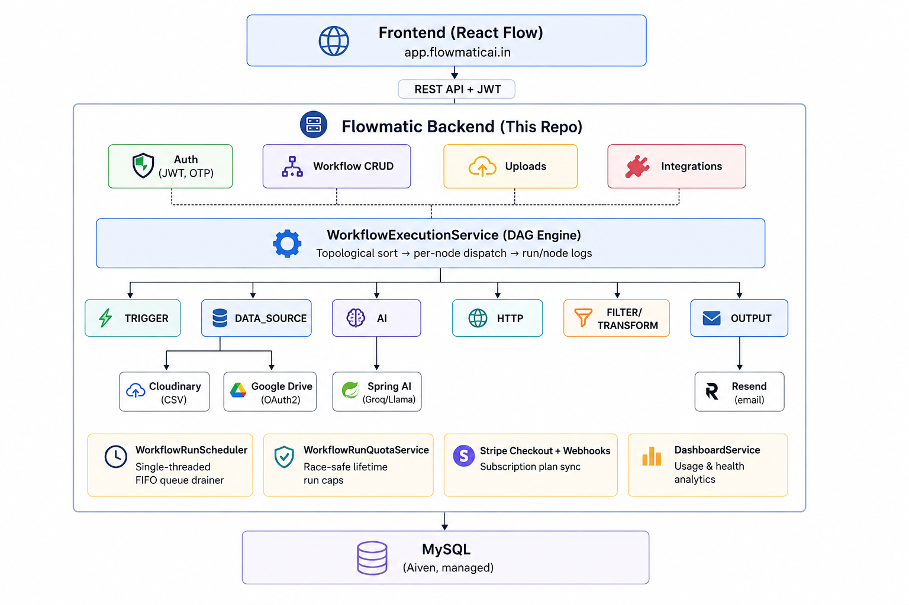

# Flowmatic — Backend

Spring Boot engine behind **[Flowmatic](https://flowmaticai.in)** — an AI-native, drag-and-drop workflow automation platform (think Zapier/n8n). This service stores, executes, and monitors the workflows built on the frontend.

🌐 [flowmaticai.in](https://flowmaticai.in) · 🚀 [app.flowmaticai.in](https://app.flowmaticai.in)

[](https://openjdk.org/)
[](https://spring.io/projects/spring-boot)
[](https://mysql.com/)
[](https://stripe.com/)
[](https://www.docker.com/)

## Features

- 🔐 **JWT auth** with email OTP verification, refresh tokens, BCrypt
- 🧩 **Visual workflow engine** — graphs run as a DAG with topological sort, conditional branching, and `{{node.field}}` templating
- 🤖 **AI nodes** (Spring AI + Groq/Llama) that reason over your data and return structured JSON, plus AI meta-prompt generation
- 📊 **Data sources** — CSV upload (Cloudinary) or live Google Drive / Sheets (OAuth2)
- 🌐 **HTTP, Filter & Transform nodes** for calling APIs and reshaping data mid-workflow
- ⚙️ **Reliable execution** — single-threaded FIFO run queue with full per-node run logs
- ✉️ **Email output** via Resend, with a human-in-the-loop "manual approval" send mode
- 💳 **Stripe subscription billing** with webhook-driven plan sync and race-safe usage quotas
- 📈 **Analytics dashboard** — success rate, run volume, and status breakdowns

## Architecture



## Tech Stack

Java 17 · Spring Boot (Web, Security, JPA) · Spring AI (Groq) · MySQL · Stripe · Cloudinary · Resend · Google OAuth2 · Docker · Maven

## Getting Started

```bash
git clone https://github.com/swayamterode/flowmatic-backend.git
cd flowmatic-backend
./mvnw spring-boot:run   # http://localhost:8080
```

Or with Docker:

```bash
docker build -t flowmatic-backend .
docker run -p 8080:8080 --env-file .env flowmatic-backend
```

Configure a MySQL instance and the API keys (Groq, Resend, Cloudinary, Stripe, Google) as environment variables — see `application.properties` for the full list.

## Testing

```bash
./mvnw test
```

## Author

**Swayam Terode** — [GitHub](https://github.com/swayamterode)
